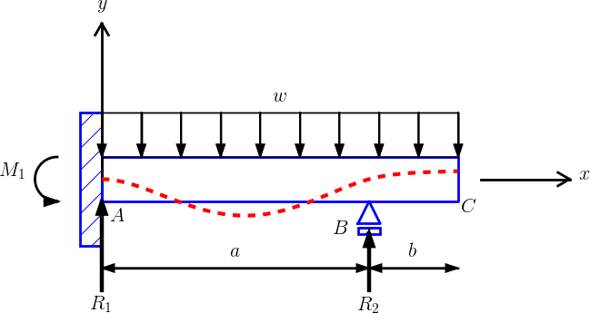

## PySketcher

*This is alpha software - the interface is likely to change with every release prior to 0.1.0.*

Tool for creating sketches of physical and mathematical problems in terms of Python code.

This library is very heavily based on the thinking of Hans Petter Langtangen however
very little if any of his code remains. Significant deviations from his library are:

1) Code is organised into multiple files and published on pypi.
2) Shapes are immutable. This means functions such as `rotate` return modified
copies of the original shape, rather than altering the shape on which they are called.
3) Angles are in radians not degrees.
4) The Composition object is used more consistently. Previously objects such as Beam
where direct children of Shape which led to code repetition.

### Purpose

PySketcher can typically be used to draw figures like

<!--  -->

Such figures can easily be *interactively* made using a lot of drawing
programs.  A Pysketcher figure, however, is defined trough
computer code. This gives a great advantage: geometric features can be
parameterized in terms of variables. Geometric variations are then
trivially generated. Also, complicated figures can be built as a
hierarchy of simpler elements.  The figure can easily be made to move
according to, e.g., a solution of a differential equation.

Here is a very simple figure that illustrates how geometric features are
parameterized by variables (H, R, L, etc.):

<!--  -->

One can then quickly change parameters, below to
`R=0.5; L=5; H=2` and `R=2; L=7; H=1`, and get new figures that would be
tedious to draw manually in an interactive tool.

<!--  -->

Another major feature of Pysketcher is the ability to let the
sketch be dynamic and make an animation of the time evolution.
Here is an example of a very simple vehicle on a bumpy road,
where the solution of a differential equation (upper blue line) is fed
back to the sketch to make a vertical displacement of the spring and
other objects in the vehicle. [View animation](http://hplgit.github.io/bumpy/doc/src/mov-bumpy/m2_k1_5_b0_2/index.html) (the animation was created by
[this Pysketcher script](https://github.com/hplgit/bumpy/blob/master/doc/src/fig-bumpy/bumpy_road_fig.py)).

<!--  -->

### Tutorial

For an introduction to Pysketcher, see the tutorial in [HTML](http://hplgit.github.io/pysketcher/doc/pub/tutorial/pysketcher.html), [Sphinx](http://hplgit.github.io/pysketcher/doc/pub/tutorial/html/index.html), or [PDF](http://hplgit/github.io/pysketcher/doc/pub/tutorial/pysketcher.pdf) format (or a simplified version of
the tutorial in Chapter 9 in [A Primer on Scientific Programming with Python](http://www.amazon.com/Scientific-Programming-Computational-Science-Engineering/dp/3642549586/ref=sr_1_2?s=books&ie=UTF8&qid=1407225588&sr=1-2&keywords=langtangen), 4th-5th edition, by H. P. Langtangen, Springer, 2014-2016).

### Examples

See the `examples` directory for some examples beyond the more basic
ones in the tutorial.
For example, an elastic beam can be sketched as

<!--  -->

The sketch was created by the program [`examples/beam2.py`](https://github.com/hplgit/pysketcher/tree/master/examples/beam2.py).

Here is an illustration of the idea of numerical integration:

<!--  -->

As shown in the figure-generating program [`examples/integral_comic_strip.py`](https://github.com/hplgit/pysketcher/tree/master/examples/integral_comic_strip.py),
this illustration can easily be turned into an [XKCD](http://xkcd.com) type of comic strip:

<!--  -->

### History

Pysketcher was first constructed as a powerful educational example on
object-oriented programming for the book
*A Primer on Scientific Programming With Python*, but the tool quickly
became so useful for the author that it was further developed and
heavily used for creating figures in other documents. It has now been picked up by Richard
Vodden, made a touch more pythonic, and compatible with later Python versions.

