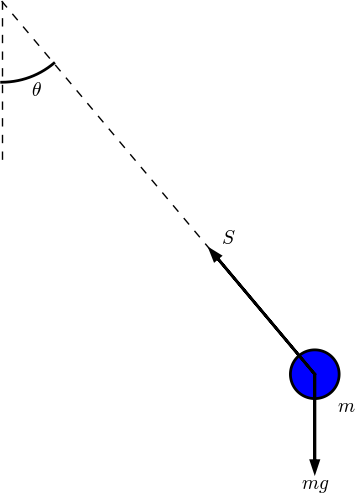

## Pysketcher

Tool for creating sketches of physics problems in terms of Python code.

### Purpose

Pysketcher can typically be used to draw figures like

<!--  -->


Such figures can easily be *interactively* made using a lot of drawing
programs.  A Pysketcher figure, however, is defined in terms of
computer code. This gives a great advantage: geometric features can be
parameterized in term of variables. Geometric variations are then
trivially generated, and complicated figures can be built as a
hierarchy of simpler elements.  The figure can easily be made to move
according to, e.g., a solution of a differential equation.

Here is a very simple figure that illustrates how geometric features are
parameterized by variables (H, R, L, etc.):

<!--  -->


One can then quickly change parameters, below to
`R=0.5; L=5; H=2` and `R=2; L=7; H=1`, and get new figures that would be
tedious to draw manually in an interactive tool.

<!--  -->


Another major feature of Pysketcher is the ability to let the
sketch be dynamic and make an animation of the time evolution.
Here is an example of a very simple vehicle on a bumpy road,
where the solution of a differential equation (upper blue line) is fed
back to the sketch to make a vertical displacement of the spring and
other objects in the vehicle. [View animation](http://hplgit.github.io/bumpy/doc/src/mov-bumpy/m2_k1_5_b0_2/index.html) (the animation was created by
[this Pysketcher script](https://github.com/hplgit/bumpy/blob/master/doc/src/fig-bumpy/bumpy_road_fig.py)).

<!--  -->


### Tutorial

For an introduction to Pysketcher, see the tutorial in [HTML](http://hplgit.github.io/pysketcher/doc/pub/pysketcher.html), [Sphinx](http://hplgit.github.io/pysketcher/doc/pub/html/index.html), or [PDF](http://hplgit/github.io/pysketcher/doc/pub/pysketcher.pdf) format (or a simplified version of
the tutorial in Chapter 9 in [A Primer on Scientific Programming with Python](http://www.amazon.com/Scientific-Programming-Computational-Science-Engineering/dp/3642549586/ref=sr_1_2?s=books&ie=UTF8&qid=1407225588&sr=1-2&keywords=langtangen), by H. P. Langtangen, Springer, 2014).

### Examples

See the `examples` directory for some examples beyond the more basic
ones in the tutorial.
For example, a pendulum and its body diagram,

<!--  -->


can be created by the program [`examples/pendulum.py`](https://github.com/hplgit/pysketcher/tree/master/examples/pendulum.py).

Here is an illustration of the idea of numerical integration:

<!--  -->


As shown in the figure-generating program [`examples/integral_comic_strip.py`](https://github.com/hplgit/pysketcher/tree/master/examples/integral_comic_strip.py),
this illustration can easily be turned into an [XKCD](http://xkcd.com) type of comic strip:

<!--  -->


### Technology

Pysketcher applies Matplotlib to make the drawings, but it is quite
easy to replace the backend `MatplotlibDraw.py` by similar code
utilizing TikZ or another plotting package. The Pysketcher software is
a thin layer basically constructing a tree structure of elements in
the sketch. A lot of classes are offered for different type of basic
elements, such as Circle, Rectangle, Text, Text with arrow, Force,
arbitrary curve, etc.  Complicated figures can be created by sticking
one figure into another (i.e., hierarchical building of figures by
sticking one tree structure into another).

### Install

Pysketcher is pure Python code and
works with Python version 2 and 3. Just do the standard


```
Terminal> sudo python setup.py install
```

Pysketcher demands installation of the following packages:

 * Matplotlib (`sudp pip install matplotlib`)
 * Future (`sudo pip install future`)
 * NumPy (`sudo pip install numpy`)

The `Spline` object in Pysketcher also requires SciPy (`sudo pip install scipy`).

### Citation

If you use Pysketcher and want to cite it, you can either cite this
web site or the book
that has the original documentation of the tool.

BibTeX format:


```
@book{Langtangen_2014,
  title = {A Primer on Scientific Programming With {P}ython},
  author = {H. P. Langtangen},
  year = {2014},
  publisher = {Springer},
  edition = {Fourth},
}

@misc{Pysketcher,
  title = {{P}ysketcher: {D}rawing tool for making sketches},
  author = {H. P. Langtangen},
  url = {https://github.com/hplgit/pysketcher},
  key = {Pysketcher},
  note = {\url{https://github.com/hplgit/pysketcher}},
}
```

Publish format:


```
* books
** A Primer on Scientific Programming With {P}ython
   key:       Langtangen_2014
   author:    H. P. Langtangen
   year:      2014
   publisher: Springer
   status:    published
   edition:   Fourth
   entrytype: book
* misc
** {P}ysketcher: {D}rawing tool for making sketches
   key:       Pysketcher
   author:    H. P. Langtangen
   url:       https://github.com/hplgit/pysketcher
   status:    published
   sortkey:   Pysketcher
   note:      \url{https://github.com/hplgit/pysketcher}
```

### History

Pysketcher was first constructed as a powerful educational example on
object-oriented programming for the book
*A Primer on Scientific Programming With Python*, but the tool quickly
became so useful for the author that it was further developed and
heavily used for creating figures in other documents.

